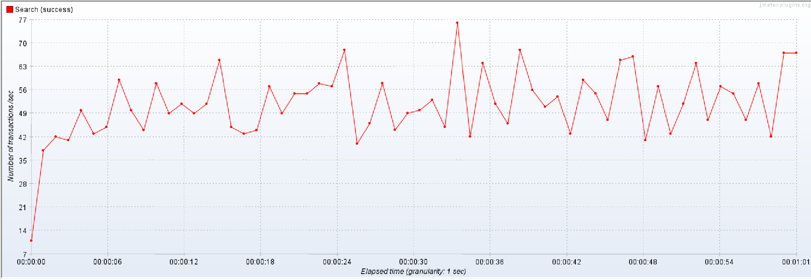
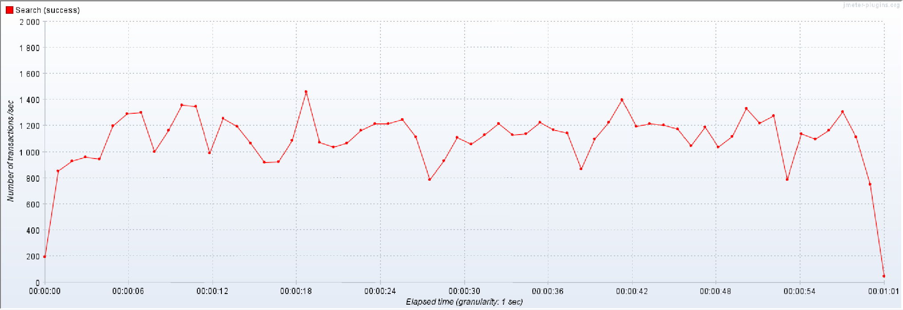
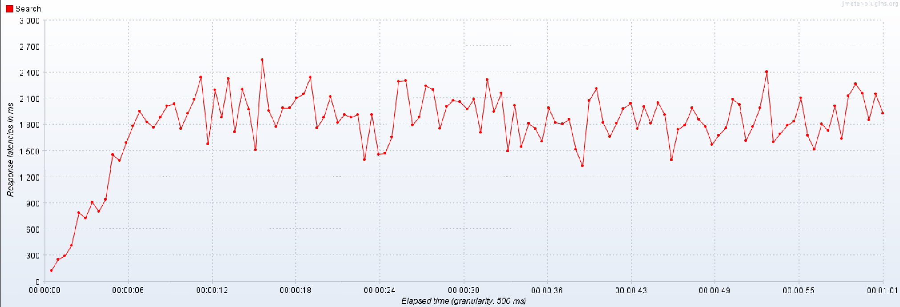
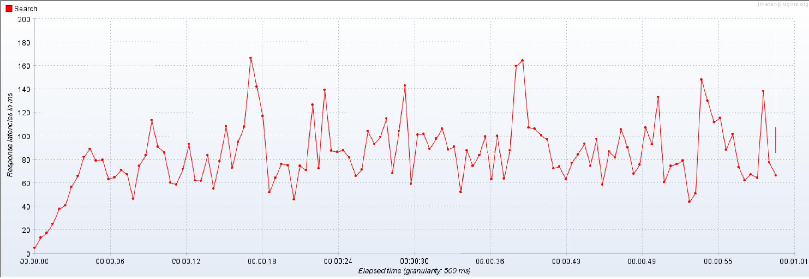

# hw2

* монолит
* реактивщина
* без ОРМ
* добавлены индексы к полям для поиска


### REPORT

1. Данные импортированны из https://raw.githubusercontent.com/OtusTeam/highload/master/homework/people.v2.csv ~ 1млн записей
2. Запрос на поиск:
   `select * from %s.person where first_name ILIKE $1 AND second_name ILIKE $2 LIMIT 100`
3. Результирующая сравнительная таблица нагрузочного тестирования с индексом и без, для throughput и latency, для 1, 10, 100 и 1000 одновременных потоков

Average throughput, requests per second:

| threads | no index | with index |
|:-------:|:--------:|:----------:|
|    1    |    8     |   139.3    |
|   10    |   48.3   |   825.8    |
|   100   |   52.3   |   1109.0   |
|  1000   |   49.1   |   908.9    |

Average latency, milliseconds:

| threads | no index | with index |
|:-------:|:--------:|:----------:|
|    1    |   125    |     7      |
|   10    |   204    |     11     |
|   100   |   1815   |     85     |
|  1000   |  17420   |    945     |

4. Графики throughput и latency в папке `report/no_idx` `report/with_indx`   
   No index, 100 threads, RPS:
   

   With index, 100 threads, RPS:
   
   
   No index, 100 threads, Latency, ms:
   

   With index, 100 threads, Latency, ms:
   
 
5. Запрос создания индекса:   
   `CREATE INDEX index_users_full_name ON otus_highload.person using gin (first_name gin_trgm_ops, second_name gin_trgm_ops);`
6. explain запроса:   
   ```explain analyze select count(*) from otus_highload.person where first_name ILIKE 'А%' AND second_name ILIKE 'Б%';```
```
   Aggregate  (cost=1579.21..1579.22 rows=1 width=8) (actual time=0.574..0.575 rows=1 loops=1)
   ->  Bitmap Heap Scan on person  (cost=24.61..1578.09 rows=450 width=0) (actual time=0.249..0.563 rows=284 loops=1)
   Recheck Cond: (((first_name)::text ~~* 'А%'::text) AND ((second_name)::text ~~* 'Б%'::text))
   Heap Blocks: exact=210
   ->  Bitmap Index Scan on index_users_full_name  (cost=0.00..24.50 rows=450 width=0) (actual time=0.227..0.228 rows=284 loops=1)
   Index Cond: (((first_name)::text ~~* 'А%'::text) AND ((second_name)::text ~~* 'Б%'::text))
   Planning Time: 1.931 ms
   Execution Time: 0.752 ms
```
7. Использовался триграмм поскольку стандартный btree не подходит для поиска типа LIKE, так же как и hash индексы.
   Можно было бы использовать полнотекстовый поиск через tsvector, но он плохо работает для поиска по префиксу и предназначен
   больше для поиска слов в тексте


### install

mvn clean install
docker build -f docker/Dockerfile.jvm -t otus-highload-hw2:latest .
docker images

### indexes

#### btree
- дефолтный, быстрый (на точное сравнение и если индекс покрывающий - 0,2-0,3 мс)
- поиск на равно и интервалы
- не работает для LIKE


create index if not exists city_idx on otus_highload.person(city);
explain analyze select count(*) from otus_highload.person where city ='Сочи';

#### hash
- сравнение только на равенство
- занимает меньше места чем btree
- я не смог сделать его быстрей чем btree, но говорят быстрее
- не работает для интервалов и LIKE

create index if not exists city_hash_idx on otus_highload.person using hash(city);
explain analyze select count(*) from otus_highload.person where city ='Сочи';

#### триграммы

- работает для LIKE
- хоть и ускоряет LIKE существенно, но все равно тяжело ~ 3-10 мс
- надо быть осторожным с составным индексом: либо делать индекс с конкатенацией либо искать по отдельности
- если делать составным индекс то и искать придется по обоим полям иначе скорость падает, а так ~ 0.5 мс

CREATE EXTENSION IF NOT EXISTS pg_trgm;
CREATE EXTENSION IF NOT EXISTS gin_trgm_ops;

CREATE INDEX trgm_idx_person_first_name ON otus_highload.person USING gin (first_name gin_trgm_ops);
CREATE INDEX trgm_idx_person_second_name ON otus_highload.person USING gin (second_name gin_trgm_ops);
OR
CREATE INDEX index_users_full_name ON otus_highload.person using gin (first_name gin_trgm_ops, second_name gin_trgm_ops);
explain analyze select count(*) from otus_highload.person where first_name ILIKE 'А%' AND second_name ILIKE 'Б%';

#### full text search with tsvector

На порядок (~ 0.2 мс) быстрее LIKE, но нужно быть аккуратно с локалью и составным индексом
не нифига не на порядок, просто если искать длинное слово то быстро а если первые буквы то тяжеловато
скорость зависит от использования вайлд карда :*, без него на порядок быстрее, точный поиск на порядок, хотя вроде все равно на порядок
И почему то не ищет по первой букве

Хорош для поиска слов , но подстроки лучше через like

create index names_tsvector_russian_idx on otus_highload.person using gin (to_tsvector('russian', first_name), to_tsvector('russian', second_name));
explain analyze SELECT count(*) FROM otus_highload.person WHERE to_tsvector('russian', first_name) @@ to_tsquery('russian', 'Спиридонов|спиридонова');
explain analyze SELECT * FROM otus_highload.person WHERE to_tsvector('russian', first_name) @@ to_tsquery('russian', 'Спиридонов|спиридонова');
explain analyze SELECT count(*) FROM otus_highload.person WHERE to_tsvector('russian', first_name) @@ to_tsquery('russian', 'Спири:*');

